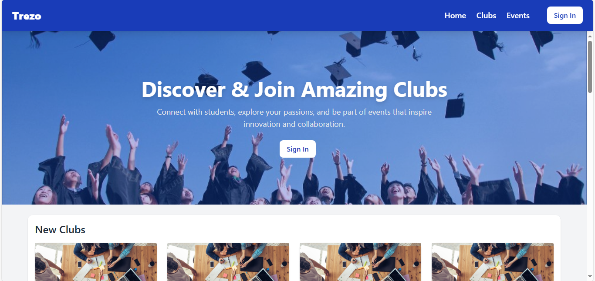
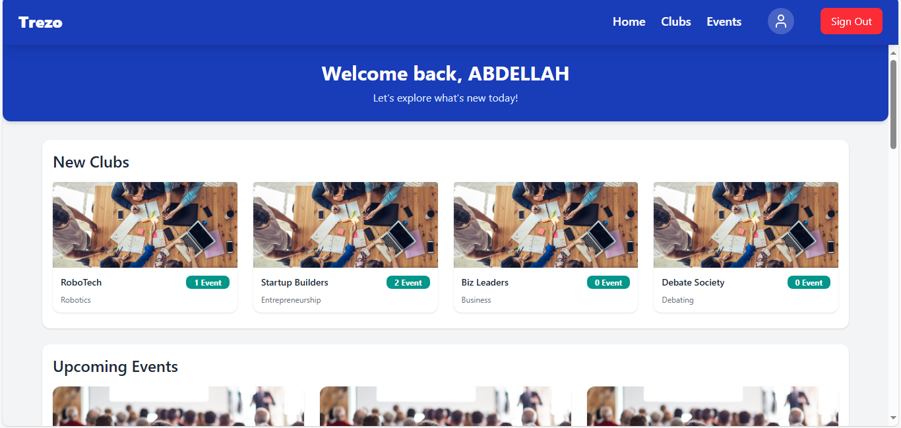
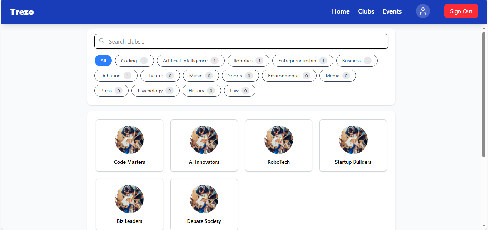
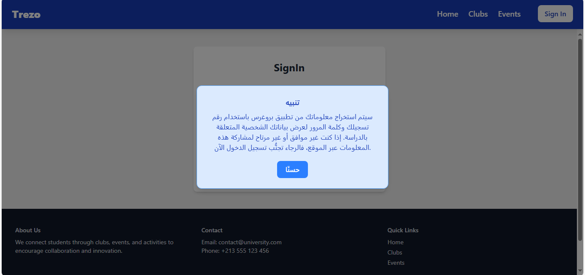
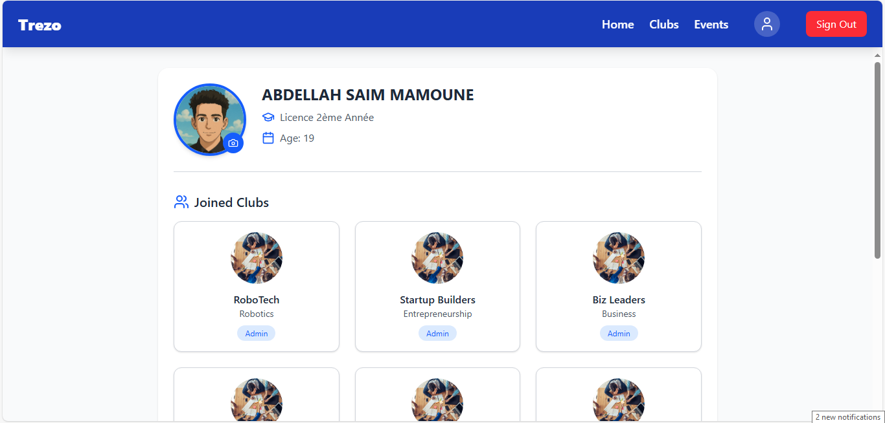
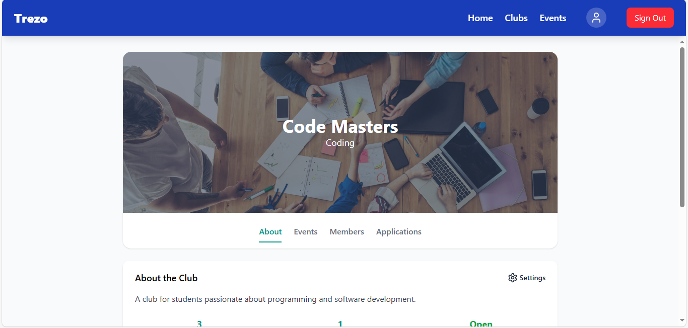
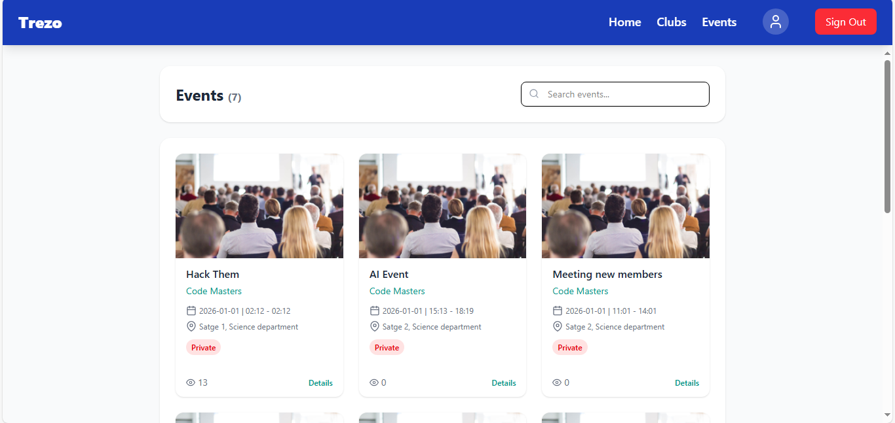
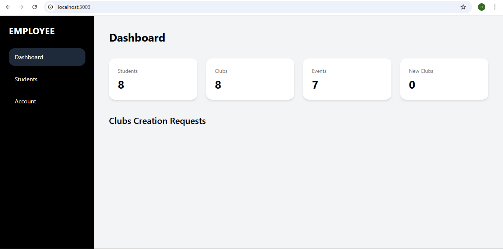
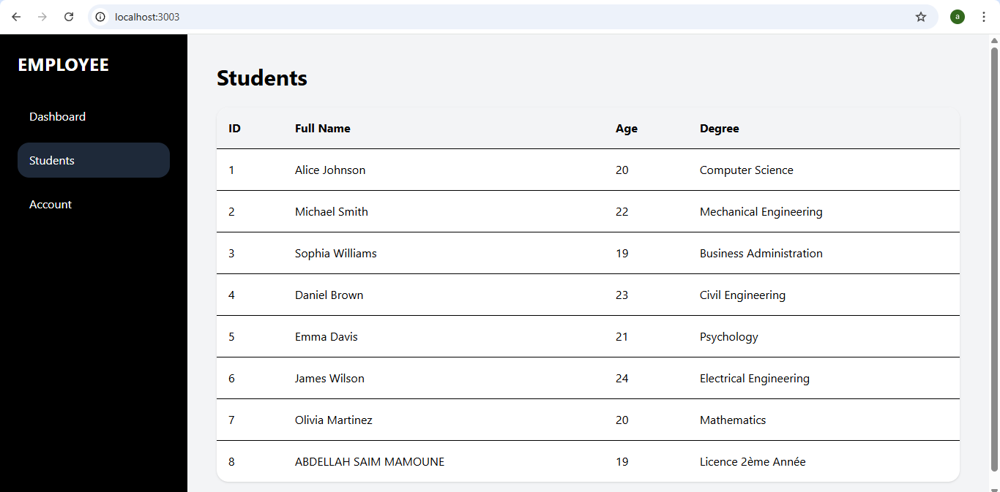
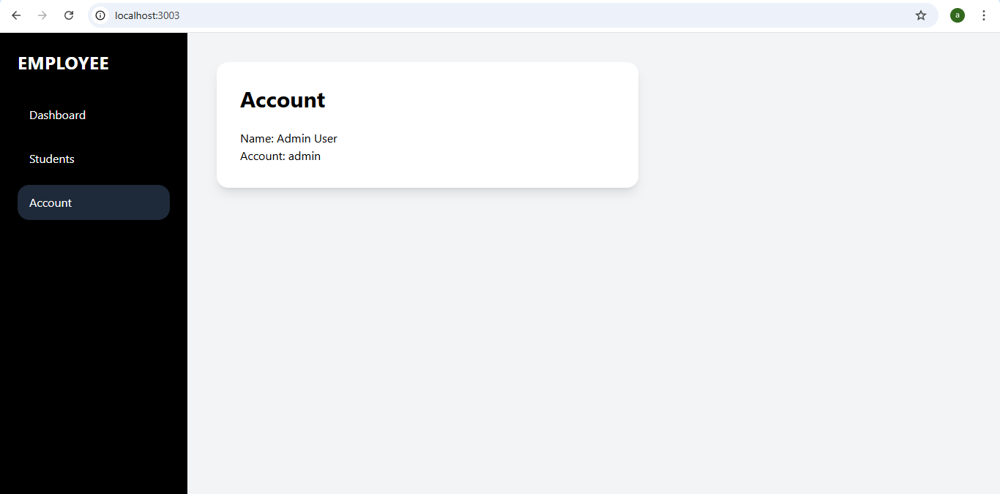

# 🎓 Clubs Management System

A full-stack web application for managing university or organizational clubs. Built with **React**, **Tailwind CSS**, and **ASP.NET Core Web API**.


 









---

## 🧩 Tech Stack

* **Frontend:** React + TypeScript + Tailwind CSS
* **Backend:** ASP.NET Core 9 + EF Core + JWT Authentication
* **Database:** SQL Server
* **Deployment:** Vercel (frontend), Azure App Service (backend)

---

## 🚀 Getting Started

### 1. Clone the Repository

```bash
git clone https://github.com/Abdellah-saim-mamoune1/Clubs_Management
cd Clubs_Management
```

### 2. Setup Frontend

```bash
cd Frontend
npm install
npm run dev
```

### 3. Setup Backend

```bash
cd Backend
dotnet restore
dotnet run
```

#### Update `appsettings.json`

```bash
{
  "Jwt": {
    "Key": "your-secret-key",
    "Issuer": "your-app",
    "Audience": "your-app",
    "AccessTokenExpirationMinutes": 10,
    "RefreshTokenExpirationDays": 7
  },
  "ConnectionStrings": {
    "DefaultConnection": "your-db-connection-string"
  }
}
```

---

## ⚙️ Features

* Connection with progress API's
* User authentication & JWT-based login
* Club creation, update, and deletion
* Event management for each club
* Member registration and role management (Admin, Club President, Member)
* Responsive, modern UI with Tailwind CSS
* Secure access control (role-based permissions)

---


## 🤝 Contributions

Contributions, suggestions, and feature requests are always welcome.

---

## 📬 Contact

If you have any questions or ideas, feel free to reach out at:
**[abdellahsaimmamoune1@gmail.com](mailto:abdellahsaimmamoune1@gmail.com)**
